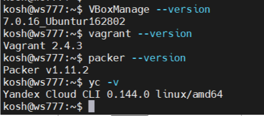
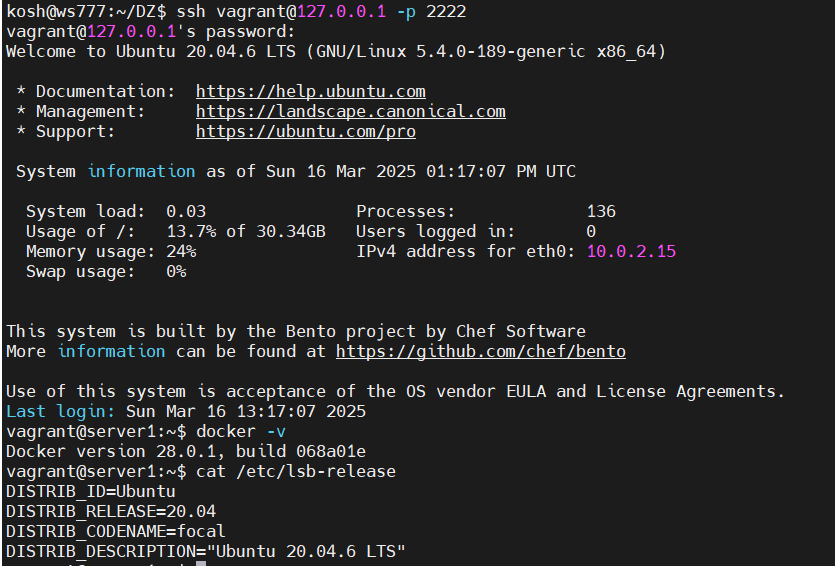
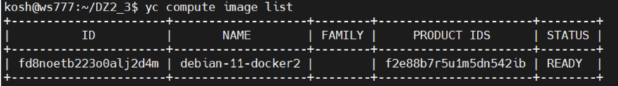
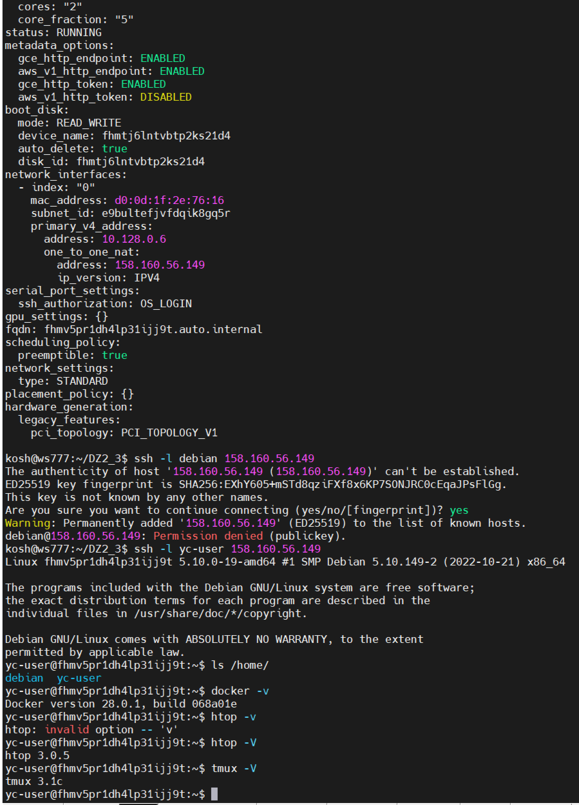

# Домашнее задание к занятию 2. «Применение принципов IaaC в работе с виртуальными машинами»

## Задача 1:

**Задание:**
Установите на личный Linux-компьютер и ПО: VirtualBox, Vagrant, Packer, уandex cloud cli. 

**Ответ:**
Установлено ПО из спика в задание
Связка Win11 + Hyper-v > Ubuntu 24



## Задача 2
**Задание:**
1. Создайте виртуальную машину Virtualbox с помощью Vagrant. 
2. Зайдите внутрь ВМ и убедитесь, что Docker установлен.

Результат:

Связка Win11 + Hyper-v > Ubuntu 24.

🚀 **Результат:** Итоговой Vagrantfile: [Vagrantfile](src/Vagrantfile)




## Задача 3
Создать сценарий сборки образа для packer, забросить его в облако яндекс, создать ВМ, проверить предустановленный софт.

**Ответ:
1. Отредактированный файл сборки для Packer [mydebian.json.pkr.hcl](src/mydebian.json.pkr.hcl), установлено:htop и tmux.
3. Образ в консоли яндекса: 
```
yc compute image list
```

 

4. Ссылка на документацию по образам: https://yandex.cloud/ru/docs/compute/cli-ref/image/list.
5. Создано новая VM:
```sh
yc compute instance create \
  --name debian-vm \
  --zone ru-central1-a \
  --platform standard-v2 \
  --cores 2 \
  --core-fraction 5 \
  --memory 2GB \
  --preemptible \
  --create-boot-disk size=20GB,type=network-hdd,image-id=fd8noetb223o0alj2d4m \
  --network-interface subnet-name=default-ru-central1-a,nat-ip-version=ipv4 \
  --ssh-key ~/.ssh/id_ed25519.pub
```
6. Подключение по SSH, проверка софта:
  