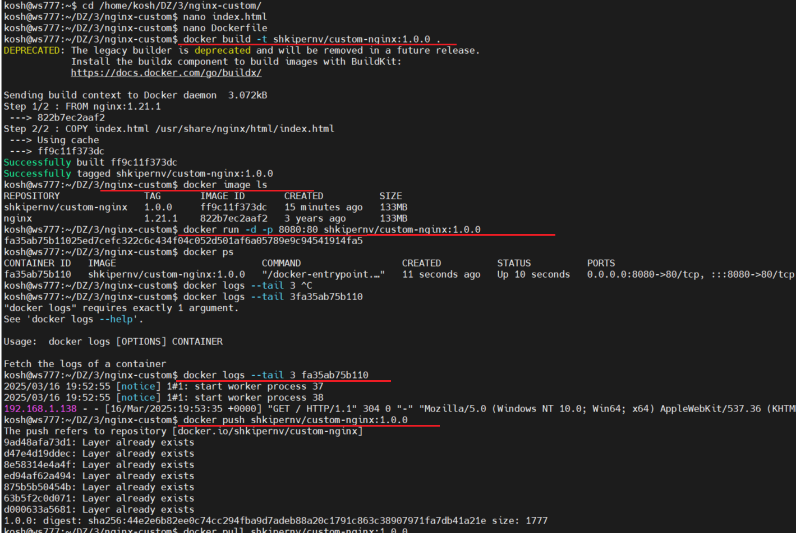

## Задача 1
 1. Установите docker и docker compose plugin
 2. Создать публичный репозиторий с именем "custom-nginx"
 3. Создайте Dockerfile
 4. Соберите и отправьте созданный образ в свой dockerhub

 **Ответ:**
 Созданый файлы:  
 1. [Dockerfile](src/Dockerfile.png)  
 2. [index.html](src/index.html)  
 Создан образ:  
 `sudo docker build -t shkipernv/custom-nginx:1.0.0 .`  
 Образ загружен:  
 `docker push shkipernv/custom-nginx:1.0.0`  
 
 [https://hub.docker.com/repository/docker/shkipernv/custom-nginx/general](https://hub.docker.com/repository/docker/shkipernv/custom-nginx/general) 
 
 
 

 
   ## Задача 2

   1. Запустите ваш образ custom-nginx:1.0.0 командой docker run
 ```sh
 docker run -d --name "scheglov_konstatin_urivich-custom-nginx-t2" -p 127.0.0.1:8080:80 shkipernv/custom-nginx:1.0.0
 ```
 2. Не удаляя, переименуйте контейнер в "custom-nginx-t2"
 ```sh
 docker rename scheglov_konstatin_urivich-custom-nginx-t2 custom-nginx-t2
 ```
 3. Выполните команды:
 ```sh
 date +"%d-%m-%Y %T.%N %Z" && \
 sleep 0.150 && \
 docker ps && \
 ss -tlpn | grep 127.0.0.1:8080 && \
 docker logs custom-nginx-t2 -n1 && \
 docker exec -it custom-nginx-t2 base64 /usr/share/nginx/html/index.html
 ```
 4. Убедитесь с помощью curl или веб браузера, что индекс-страница доступна.
 ```sh
 5. curl 127.0.0.1:8080
 ```
 **Ответ:**
  

## Задача 3

 **Задание:**
 Содать контейер nginx, работа с пробросом портов и изменение конфига контейнера. 

 **Отввет:**
 **1. Подключение к контейнеру**
 Подключиться к стандартному потоку ввода/вывода/ошибок контейнера.
 ```bash
 docker attach custom-nginx-t2
 ```
 Выход по `Ctrl-C`

 **2. Проверка статуса контейнера**
 ```bash
 docker ps -a
 ```
 **Объяснение:** Контейнер остановился, потому что `Ctrl-C` отправил сигнал `SIGINT` процессу nginx, так как nginx основной процеес, но при его завершении стопится контейнер.

 **3. Перезапуск контейнера**
 ```bash
 docker restart custom-nginx-t2
 ```

 **4. Вход в интерактивный терминал**
 ```bash
 docker exec -it custom-nginx-t2 bash
 ```

 **5. Установка текстового редактора**  
  ```bash
 apt-get update && apt-get install -y mc
 ```
 
 

 **6. Редактирование конфигурации Nginx**
 Редактировать конфиг:
 ```bash
 mcedit /etc/nginx/conf.d/default.conf
 ```
 Замена `listen 80` на `listen 81`.

 **7. Перезагрузка Nginx и проверка**
 ```bash
 nginx -s reload
 ```
 Проверка портов внутри контейнера:
 ```bash
 curl http://127.0.0.1:80   # старый порт
 curl http://127.0.0.1:81   # новый порт
 ```

 **8. Выход из контейнера**
 ```bash
 exit
 ```

 **9. Проверка портов на хосте**
 ```bash
 ss -tlpn | grep 127.0.0.1:8080
 docker port custom-nginx-t2
 curl http://127.0.0.1:8080
 ```
 

 **Объяснение:** Порт `8080` на хосте не отвечает, так ранее был проброшен на `80` внетренний порт, я изменили порт на `81`. Проброс портов теперь не соответствует конфигурации Nginx.

 **10. Исправление конфигурации**
 Исправляю конфигурацию без пересоздания контенера, commit сбросит контекст контейнера:

 1) Останавливаю контейнер и слубы docker
 ```bash
 docker stop custom-nginx-t2 
 sudo systemctl stop docker.service
 sudo systemctl stop docker.socket
 sudo systemctl status docker
 ```
 2) Правлю конфиги в папке контейнера
 ```bash
 sudo vim /var/lib/docker/containers/37d1371875422333dfb101004befcc948a1ebdceaf242268086283cd58f5fc6d/hostconfig.json
 ```
 
 ```bash
 sudo vim /var/lib/docker/containers/37d1371875422333dfb101004befcc948a1ebdceaf242268086283cd58f5fc6d/config.v2.json
 ```
 

 3) Запуская службы docker и контенер
 ```bash
 sudo systemctl start docker.socket
 sudo systemctl start docker.service
 sudo systemctl status docker
 docker start custom-nginx-t2
 ```
 

 4) Проверяю новый проброс партов и доступ.
 ```bash
 docker port custom-nginx-t2
 curl http://127.0.0.1:8080
 ```
 

 **11. Удаление контейнера**
 Без остановки:
 ```bash
 docker rm -f custom-nginx-t2
 ```
 

## Задача 4
 **Задачние:**
 Проверка обмена доступности файлов между контейнерами.

 **Ответ:**

 1. Запуск первого контейнера (CentOS):  
 ```bash
 docker run -d -v $(pwd):/data centos sleep infinity
 ```    
 2. Запуск второго контейнера (Debian):  
 ```bash
 docker run -d -v $(pwd):/data debian sleep infinity
 ```    
 3. Подключение к первому контейнеру и создание файла:
 ```bash
 docker ps
 docker exec -it 13e070cba2de bash
 echo "Текст" > /data/file1.txt
 exit
 ```    
 4. Создание файла на хосте:  
 ```bash
 echo "Другой текст" > $(pwd)/file2.txt
 ```    
 5. Подключение ко второму контейнеру и проверка:  
 ```bash
 docker exec -it 6ae6c3da3741 bash
 ls -l /data
 cat /data/file1.txt /data/file2.txt
 exit
 ```  
 

## Задача 5

 **Задачние:**
 Проверка обмена доступности файлов между контейнерами.

 **Ответ:**
 1. Создал файлы: `compose.yaml` и `docker-compose.yaml`.  
   
 ```bash
 mkdir -p Z/3/docker/task5`
 cd DZ/3/docker/task5`
 mcedit compose.yaml`
 mcedit docker-compose.yaml`
 docker compose up -d
 ```  

 **Пояснение:**
 После выполнения `docker compose up -d` запустился только `compose.yaml`, так как по умолчанию Docker Compose использует файл с именем `compose.yaml` или `docker-compose.yaml`, а при наличии обоих приоритет отдается `compose.yaml` (см. [документацию](https://docs.docker.com/compose/compose-application-model/#the-compose-file)).
 

 2. Отредактировал дерективу `include` в файле `compose.yaml`, чтобы включить оба файла (см. [документацию по include](https://docs.docker.com/compose/compose-file/14-include/)).:  
```yaml
version: "3"
services:
  portainer:
    network_mode: host
    image: portainer/portainer-ce:latest
    volumes:
      - /var/run/docker.sock:/var/run/docker.sock
include:
  - docker-compose.yaml
 ```  
 ```bash
 docker compose up -d
 ```

3. Выполнил команды для загрузки образа `custom-nginx:latest` в локальный registry:  
 ```bash
 docker tag shkipernv/custom-nginx:1.0.0 localhost:5000/custom-nginx:latest
 docker push localhost:5000/custom-nginx:latest
 ```  
   Образ успешно загружен в `registry` на порту 5000.

4. Открыл `https://127.0.0.1:9000`, настроил Portainer, задав логин и пароль администратора, подрузил nginx.


5. Описания ошибки "сирота", удаление проекта.

 ```bash
 rm compose.yaml
 docker compose up -d
 ```  
 **Пояснение:**
 Ощибка `orphaned container` озникает, потому что Docker Compose "помнит" предыдущую конфигурацию проекта. Когда я удалили compose.yaml, сервис portainer перестал быть частью активной конфигурации, но его контейнер остался в системе. Docker Compose считает такие контейнеры "сиротами", если они больше не соответствуют текущему файлу Compose.
   

 ```bash
 docker compose down --remove-orphans
 ```
 


