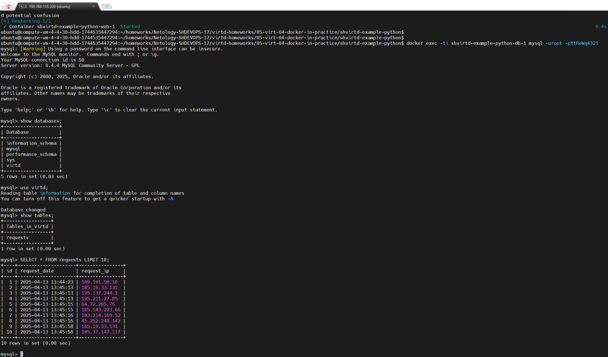

## Задача 1
Делаю форк репозитория, для удобства на локальном компьютере добавляю его в нужную директорию через субмодули:  
`$ git submodule add https://github.com/koshnv/shvirtd-example-python.git virtd-homeworks/05-virt-04-docker-in-practice/shvirtd-example-python`

Создаю виртуальное окружение и устанавливаю зависимости:  
`$ python3 -m venv .venv`  
`$ source .venv/bin/activate`  
`$ pip install --no-cache-dir -r requirements.txt`  

Для тестирования и отладки запускаю сервер MySQL в контейнере:  
`$ docker run -d --name mysql-db -e MYSQL_ROOT_PASSWORD=YtReWq4321 -e MYSQL_DATABASE=virtd -e MYSQL_USER=app -e MYSQL_PASSWORD=QwErTy1234 -p 3306:3306 mysql:latest`  
Проверяю работу сервера MySQL:  
`$ docker exec -it mysql-db mysql -uapp -pQwErTy1234 -h127.0.0.1 virtd`  

Для запуска Python-приложения добавляю переменные окружения из файла `.env` (можно было бы использовать библиотеку `python-dotenv`, но в данном случае задаю вручную):  
`$ export DB_USER=app`  
`$ export DB_PASSWORD=QwErTy1234`  
`$ export DB_NAME=virtd`  
`$ export DB_HOST=127.0.0.1`  

Запускаю приложение:  
`$ python main.py`  

Была ошибка, отсутствовала переменная `DB_HOST=127.0.0.1`. После её добавления приложение запустилось.  

Собираю образ:  
`$ docker build -f Dockerfile.python -t python-app:test .`  
`$ docker images`

## Задача 2

Создаю реестр в Yandex Cloud:  
`$ yc container registry create --name test`  

Вывод команды:  
    `done (1s)`  
    `id: crp951l9uq6957ruf56i`  
    `folder_id: b1gl1jlokpp0fb08pgic`  
    `name: test`  
    `status: ACTIVE`  
    `created_at: "2025-04-13T12:43:55.901Z"`  
Для отправки в реестр добавляю префикс реестра:  
`$ docker tag python-app:test cr.yandex/crp951l9uq6957ruf56i/python-app:test`  
Загружаю образ в Yandex Container Registry:  
`$ docker push cr.yandex/crp951l9uq6957ruf56i/python-app:test`  
Проверяю реестр:  
`$ yc container image list`  
Тестирую образ:  
`$ yc container image scan crpsnslet6k7f2vu7f77`  


## Задача 3
Создаю файл `compose.yaml`.  
Вместо сборки образа локально (с использованием `Dockerfile.python`) решил скачать его из Yandex Container Registry. Возможный вариант сборки:  
`build:`  
`  context: .`  
`  dockerfile: Dockerfile.python`  
Сеть определена в `proxy.yaml`, фиксирую только IP:  
[compose.yaml](shvirtd-example-python/compose.yaml)  
Запускаю сборку:  
`$ docker compose up -d`  
Проверяю доступность через браузер.  
Через сервис только раз выдал `OK`.  
Подключаюсь к консоли MySQL:  
`$ docker exec -ti shvirtd-example-python-db-1 mysql -uroot -pYtReWq4321`  
Выполняю запрос:  
```sql  
show databases;  
use virtd;  
show tables;  
SELECT * FROM requests LIMIT 10;
```  
  