## Задача 1
Делаю форк репозитория, для удобства на локальном компьютере добавляю его в нужную директорию через субмодули:  
`$ git submodule add https://github.com/koshnv/shvirtd-example-python.git virtd-homeworks/05-virt-04-docker-in-practice/shvirtd-example-python`

Создаю виртуальное окружение и устанавливаю зависимости:  
`$ python3 -m venv .venv`  
`$ source .venv/bin/activate`  
`$ pip install --no-cache-dir -r requirements.txt`  

Для тестирования и отладки запускаю сервер MySQL в контейнере:  
`$ docker run -d --name mysql-db -e MYSQL_ROOT_PASSWORD=YtReWq4321 -e MYSQL_DATABASE=virtd -e MYSQL_USER=app -e MYSQL_PASSWORD=QwErTy1234 -p 3306:3306 mysql:latest`  
Проверяю работу сервера MySQL:  
`$ docker exec -it mysql-db mysql -uapp -pQwErTy1234 -h127.0.0.1 virtd`  

Для запуска Python-приложения добавляю переменные окружения из файла `.env` (можно было бы использовать библиотеку `python-dotenv`, но в данном случае задаю вручную):  
`$ export DB_USER=app`  
`$ export DB_PASSWORD=QwErTy1234`  
`$ export DB_NAME=virtd`  
`$ export DB_HOST=127.0.0.1`  

Запускаю приложение:  
`$ python main.py`  

Была ошибка, отсутствовала переменная `DB_HOST=127.0.0.1`. После её добавления приложение запустилось.  

Собираю образ:  
`$ docker build -f Dockerfile.python -t python-app:test .`  
`$ docker images`
---
## Задача 2

Создаю реестр в Yandex Cloud:  
`$ yc container registry create --name test`  

Вывод команды:  
    `done (1s)`  
    `id: crp951l9uq6957ruf56i`  
    `folder_id: b1gl1jlokpp0fb08pgic`  
    `name: test`  
    `status: ACTIVE`  
    `created_at: "2025-04-13T12:43:55.901Z"`  
Для отправки в реестр добавляю префикс реестра:  
`$ docker tag python-app:test cr.yandex/crp951l9uq6957ruf56i/python-app:test`  
Загружаю образ в Yandex Container Registry:  
`$ docker push cr.yandex/crp951l9uq6957ruf56i/python-app:test`  
Проверяю реестр:  
`$ yc container image list`  
Тестирую образ:  
`$ yc container image scan crpsnslet6k7f2vu7f77`  
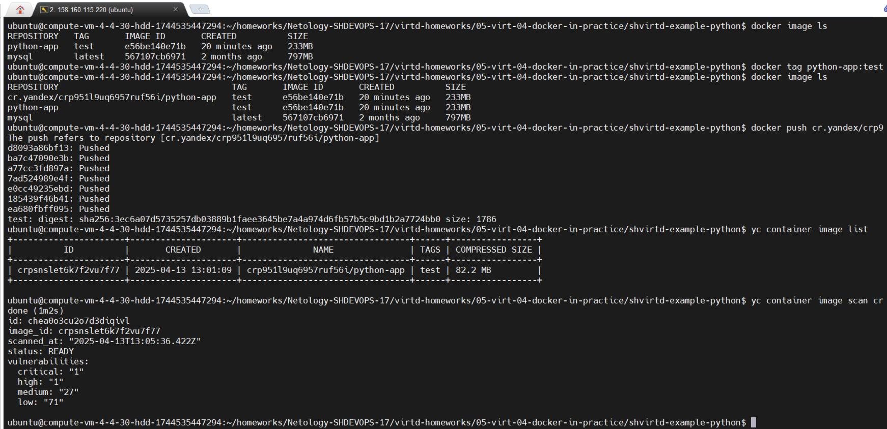
---

## Задача 3
Создаю файл `compose.yaml`.  
Вместо сборки образа локально (с использованием `Dockerfile.python`) решил скачать его из Yandex Container Registry. Возможный вариант сборки:  
`build:`  
`  context: .`  
`  dockerfile: Dockerfile.python`  
Сеть определена в `proxy.yaml`, фиксирую только IP:  
[compose.yaml](shvirtd-example-python/compose.yaml)  
Запускаю сборку:  
`$ docker compose up -d`  
Проверяю доступность через браузер.  
Через сервис только раз выдал `OK`.  
Подключаюсь к консоли MySQL:  
`$ docker exec -ti shvirtd-example-python-db-1 mysql -uroot -pYtReWq4321`  
Выполняю запрос:  
```sql  
show databases;  
use virtd;  
show tables;  
SELECT * FROM requests LIMIT 10;
```  
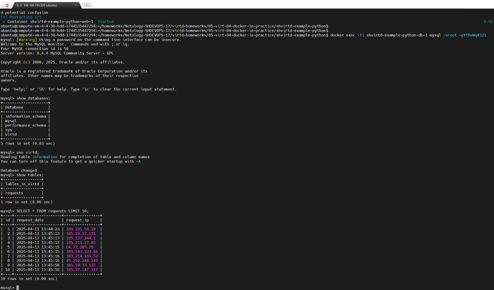
---

## Задача 4  

Создаю директорию `deploy` и перехожу в неё:
   ```bash
   mkdir deploy
   cd deploy/
   ```
Создаю bash-скрипт `deploy_project.sh`:
   ```bash
   nano deploy_project.sh
   ```

Содержимое скрипта `deploy_project.sh`:
```bash
#!/bin/bash

Создаём каталог /opt и переходим в него
sudo mkdir -p /opt
cd /opt

# Клонируем репозиторий
echo "Клонируем репозиторий..."
sudo git clone https://github.com/koshnv/shvirtd-example-python.git
cd shvirtd-example-python
pwd

# Устанавливаем права на каталог
sudo chown -R $USER:$USER /opt/shvirtd-example-python

# Запускаем проект через Docker Compose
echo "Запускаем проект..."
docker compose up -d

# Выводим информацию о запущенных контейнерах
echo "Проект запущен. Список контейнеров:"
docker compose ps -a

```

Настраиваю Docker для работы с Yandex Container Registry: 
   ```bash
   yc container registry configure-docker
   ```

Проверяю, что запись добавлена в конфигурацию Docker:
cat ~/.docker/config.json
   ```json
   {
     "credHelpers": {
       "cr.yandex": "yc"
     }
   }
   ```
Делаю скрипт исполняемым и запускаю его:
   ```bash
   chmod +x deploy_project.sh
   ./deploy_project.sh
   ```

Запускаю проверку http через сайт https://check-host.net/check-http?host=http://89.169.155.213:8090/

Захожу в контейнер с БД для выполнения запроса:
   ```bash
   docker exec -ti shvirtd-example-python-db-1 mysql -uroot -pYtReWq4321
   ```

Вывожу список IP с которых приходили запросы:
   ```sql
   USE virtd;
   SELECT * FROM requests LIMIT 10;
   ```
**Ответ:**
   [fork-репозиторий проекта shvirtd-example-python](https://github.com/koshnv/shvirtd-example-python)
   [deploy_project.sh](shvirtd-example-python/deploy_project.sh)

   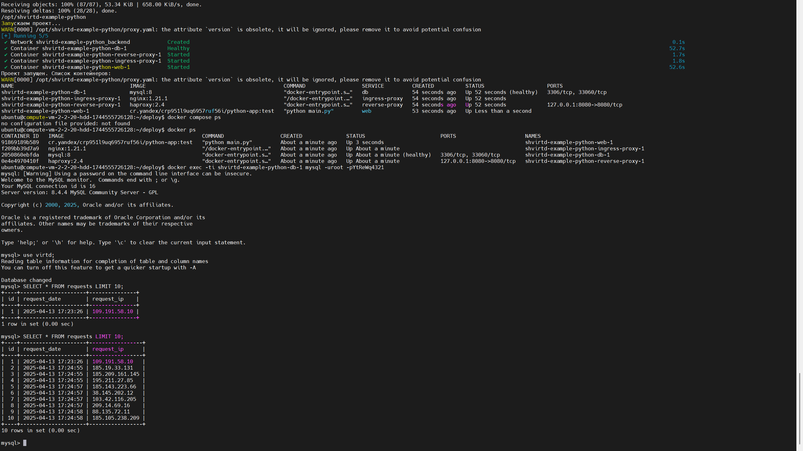
---

## Задача 5

Создаю каталог для бэкапов:  
```bash  
sudo mkdir -p /opt/backup  
sudo chown $USER:$USER /opt/backup
```
Создаю скрипт для бэкапирования:
```bash 
cd /opt/shvirtd-example-python/  
nano backup_mysql.sh
```
Пример скрипта:
```bash
#!/bin/bash

# flock для предотвращения одновременного запуска
exec 200>/var/lock/backup_mysql.lock
flock -n 200 || { echo "Скрипт уже выполняется, пропускаем запуск"; exit 1; }

BACKUP_DIR="/opt/backup"

DB_NAME="virtd"

DB_HOST="db"

# Не палим пароль, буру из файла .env
if [ -f "/opt/shvirtd-example-python/.env" ]; then
    source /opt/shvirtd-example-python/.env
else
    echo "Ошибка: файл .env не найден в /opt/shvirtd-example-python/"
    exit 1
fi

# Проверка переменных
if [ -z "$MYSQL_USER" ] || [ -z "$MYSQL_PASSWORD" ]; then
    echo "Ошибка: переменные MYSQL_USER и/или MYSQL_PASSWORD не установлены"
    exit 1
fi

# Имя файла для резервной копии
BACKUP_FILE="$BACKUP_DIR/backup_$(date +%Y%m%d_%H%M%S).sql"

# Стартую контейнер
docker run --rm \
    --network shvirtd-example-python_backend \
    --env MYSQL_PWD="$MYSQL_PASSWORD" \
    mysql:8 \
    mysqldump -h "$DB_HOST" -u "$MYSQL_USER" --no-tablespaces "$DB_NAME" > "$BACKUP_FILE"

# Проверка создания копии
if [ $? -eq 0 ]; then
    echo "Резервная копия создана: $BACKUP_FILE"
else
    echo "Ошибка при создании резервной копии"
    exit 1
fi
```
Делаю сприпт исполняемым:
```bash
chmod +x backup_mysql.sh
```
Тестирование ручного запуска:
```bash
./backup_mysql.sh
```
Настраиваю `cron`
```bash
crontab -e
```
Добавляю задачу, чтобы скрипт выполнялся каждую минуту:
```cron
* * * * * /opt/shvirtd-example-python/backup_mysql.sh >> /opt/backup/backup.log 2>&1
```

**Безопасность учетных данных:**

Чтобы не светить логин/пароль в Git, я использовал файл `.env`, который уже есть в `/opt/shvirtd-example-python/.env`. Этот файл не должен попадать в репозиторий Git. Он добавлен в `.gitignore`:


Ответ:
[backup_mysql.sh](shvirtd-example-python/backup_mysql.sh)
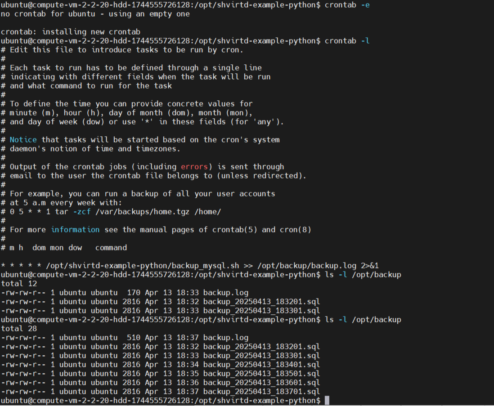
---

## Задача 6

Устанавливаю dive:
```bash
wget https://github.com/wagoodman/dive/releases/download/v0.12.0/dive_0.12.0_linux_amd64.deb
sudo dpkg -i dive_0.12.0_linux_amd64.deb
dive --version
```
Качаю образ:
`docker pull hashicorp/terraform:latest`
Использую dive для анализа образа
`dive hashicorp/terraform:latest`
Слой с нужным файлом:
Хэш слоя — 63be41f6e91654e2eb3654a0d780e15fa9a05bc062b9ec1c8f3189f650a1393d
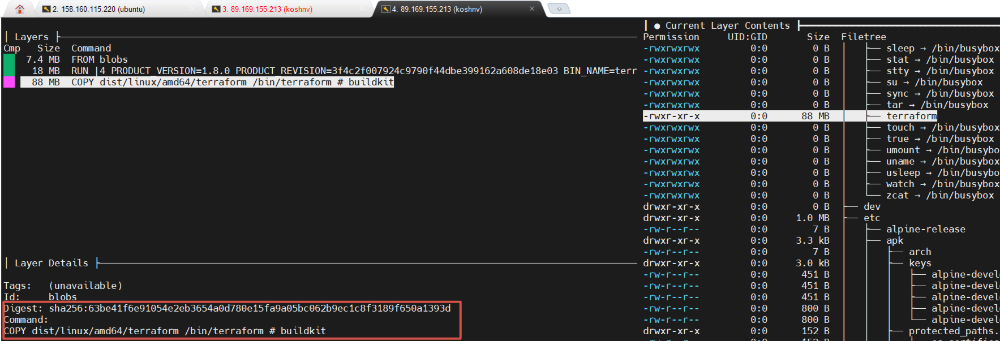

Сохраняю файл:
1. Сохраните образ в tar-архив:
`docker save -o terraform-image.tar hashicorp/terraform:1.8.0`
2. Распаковка образа
```sh
mkdir terraform-extract`
tar -xvf ../terraform-image.tar
```
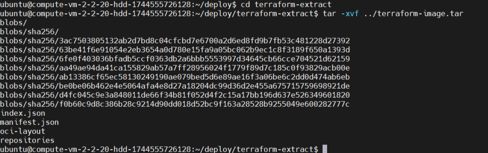  
3. Достаю файл terraform из архива
`cd blobs/sha256`
tar -xvf 63be41f6e91654e2eb3654a0d780e15fa9a05bc062b9ec1c8f3189f650a1393d bin/terraform
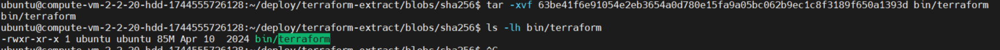 
4. Копирования на локальную машину:
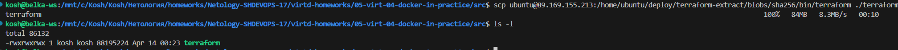
---

## Задача 6.1

Создаю временный контейнер из образа:
`docker create --name terraform-temp hashicorp/terraform:1.8.0`
`cd ~/deploy/`
Копирую файл из контейнера:
`docker cp terraform-temp:/bin/terraform ./terraform`
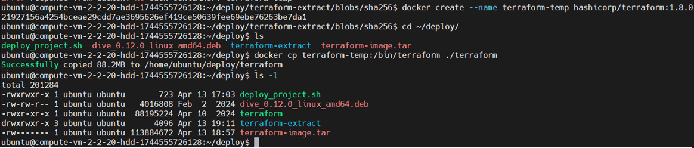

## Задача 7.1

С Docker 18.09, можно использовать `--output` для копирования файлов из сборки напрямую на хост.

1. Создаю `Dockerfile`:

```dockerfile
FROM alpine:latest

# Тестовый файл внутри контейнера
RUN echo "Hello, extracted file!" > /output.txt
```

2.  Собираем образ и сразу извлекаем файл:

```sh
docker build --output . .
```

Здесь `--output .` говорит Docker'у скопировать всё из финального слоя образа в текущую директорию.

3. Проверяю содержимое файла:

```sh
cat output.txt
```

**Обяснение:**

- `docker build --output` позволяет сохранять артефакты прямо на хосте, минуя создание контейнера.
- Вся структура файловой системы финального слоя копируется в указанную директорию.
- Работает **без запуска контейнера** и без `docker cp`.

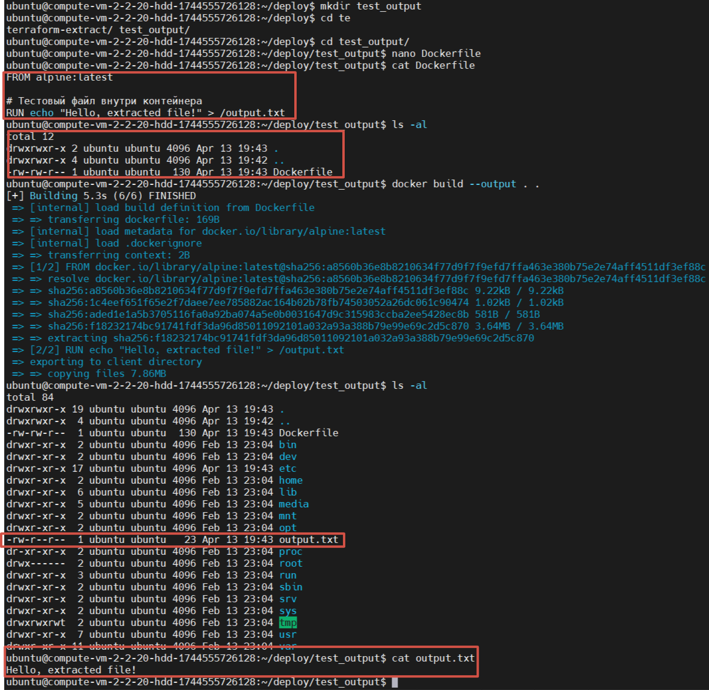
---

## Задача 7
**Запуск Python-приложения с runC**

Возможное решение через создание:
1. **Минимальная файловая система** с `busybox`
2. **Устанавливаем Python внутрь rootfs**
3. **Устанавливаем зависимости для Python**
4. **OCI-совместимый конфиг для runC**
5. **Стартуем приложение**

Проверяю версию:  
```bash  
runc --version
```
Cоздаю каталог и перехожу в него для минимальной файловой системы:  
```bash  
mkdir -p my_container/rootfs  
cd my_container  
```  
Загружаю минимальную файловую систему **rootfs**:  
```bash  
sudo docker export $(sudo docker create busybox) | sudo tar -C rootfs -xvf -  
```  
Ленюсь и использую **Docker**, чтобы быстро получить базовую файловую систему. В реальной среде можно скачать `busybox` вручную.  
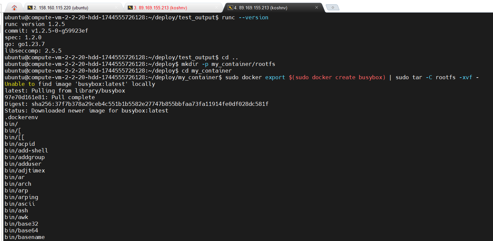  

В файловой системе нет Python и его зависимых библиотек, беру базовый образ python:3.11-slim и все вытаскиваю из него:  
```bash  
sudo find rootfs -name "python*"  
```  
Создаю контейнер:  
```bash  
sudo docker create --name python-temp python:3.11-slim  
```  

Выдергиваю бинарник:  
```bash  
sudo docker cp python-temp:/usr/local/bin/python3.11 rootfs/usr/bin/python3.11  
```  

Создаю символическую ссылку:  
```bash  
cd rootfs/usr/bin  
sudo ln -s python3.11 python3  
cd ~/deploy/my_container  
```  

Проверка:  
```bash  
ls -lh rootfs/usr/bin/python*  
```  

Копирование зависимостей:  
```bash  
sudo docker cp python-temp:/usr/local/lib/libpython3.11.so.1.0 rootfs/usr/local/lib/libpython3.11.so.1.0  
sudo docker cp python-temp:/usr/local/lib/python3.11 rootfs/usr/local/lib/python3.11  
sudo docker cp python-temp:/usr/local/lib/python3.11/lib-dynload rootfs/usr/local/lib/python3.11/lib-dynload 
sudo docker cp python-temp:/lib/x86_64-linux-gnu/libc.so.6 rootfs/lib/x86_64-linux-gnu/libc.so.6
sudo docker cp python-temp:/lib/x86_64-linux-gnu/libpthread.so.0 rootfs/lib/x86_64-linux-gnu/libpthread.so.0
sudo docker cp python-temp:/lib/x86_64-linux-gnu/libdl.so.2 rootfs/lib/x86_64-linux-gnu/libdl.so.2
sudo docker cp python-temp:/lib/x86_64-linux-gnu/libutil.so.1 rootfs/lib/x86_64-linux-gnu/libutil.so.1
sudo docker cp python-temp:/lib/x86_64-linux-gnu/libm.so.6 rootfs/lib/x86_64-linux-gnu/libm.so.6
sudo docker cp python-temp:/lib64/ld-linux-x86-64.so.2 rootfs/lib64/ld-linux-x86-64.so.2 
```  

Проверил зависимости:  
```bash  
ldd rootfs/usr/bin/python3.11  
```  

Удаляю временный контейнер:  
```bash  
sudo docker rm python-temp  
```  
 
OCI-спецификация требует `config.json`. Генерирую его:
```sh
cd my_container
runc spec
```
Редактирую config.json, добавляя LD_LIBRARY_PATH:

```json
{
 "¿ociVersion": "1.0.0",
 "process": {
   "terminal": true,
   "user": { "uid": 0, "gid": 0 },
   "args": ["/usr/bin/python3.11", "-c", "print('Hello from runC!')"],
   "env": [
     "PATH=/usr/bin:/bin",
     "TERM=xterm",
     "LD_LIBRARY_PATH=/usr/local/lib:/lib/x86_64-linux-gnu:/usr/lib/x86_64-linux-gnu"
   ],
   "cwd": "/",
   "capabilities": {
     "bounding": ["CAP_AUDIT_WRITE", "CAP_KILL", "CAP_NET_BIND_SERVICE"]
   }
 },
 "root": {
   "path": "rootfs",
   "readonly": true
 },
 "hostname": "my-container",
 "mounts": [
   {
     "destination": "/proc",
     "type": "proc",
     "source": "proc"
   },
   {
     "destination": "/dev",
     "type": "tmpfs",
     "source": "tmpfs",
     "options": ["nosuid", "strictatime", "mode=755"]
   },
   {
     "destination": "/dev/pts",
     "type": "devpts",
     "source": "devpts",
     "options": ["nosuid", "noexec", "newinstance", "ptmxmode=0666"]
   }
 ],
 "linux": {
   "namespaces": [
     {"type": "pid"},
     {"type": "network"},
     {"type": "ipc"},
     {"type": "uts"},
     {"type": "mount"}
   ]
 }
}
```
[config.json](src/config.json)

Запускаю приложение:  
```bash  
sudo runc run my_python_container  
```  
[config.json](src/config.json)
**Ответ:**
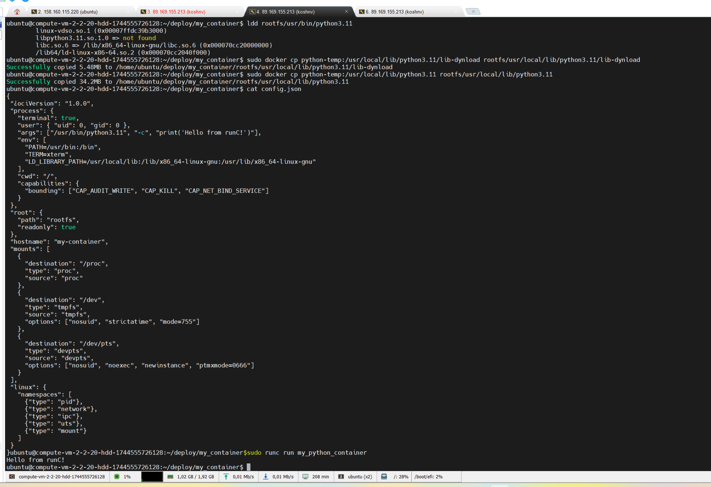
